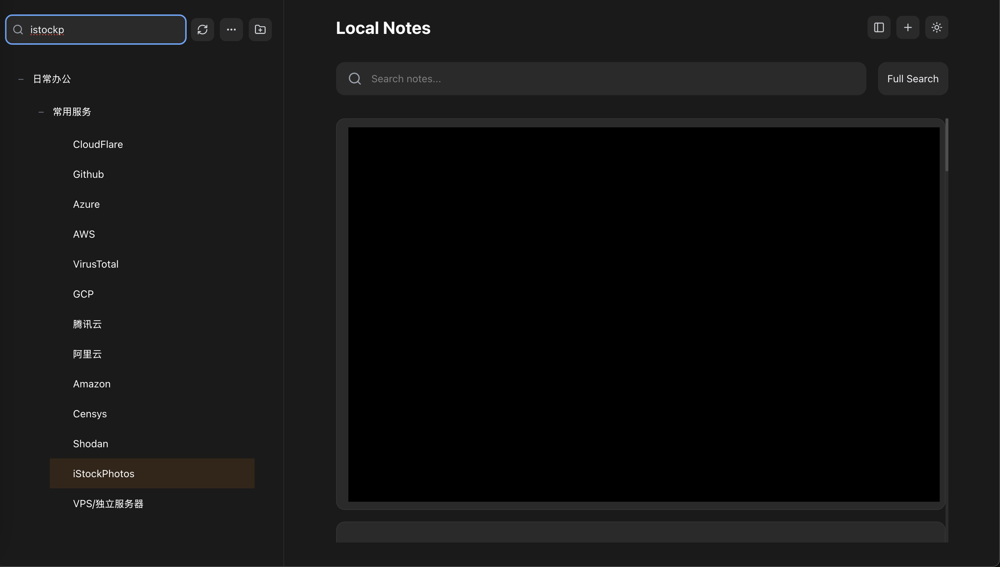

# 📁 Local Notes

I needed an editor to handle all my research and corporate documents—something that supports both basic Markdown and advanced features like mindmaps and flowcharts. **Draw.io** is perfect for procedural diagrams, and **Tiptap** gives me the rich editing foundation I want.

I tried Notion, but it's sluggish (probably network issues), and I worry about lock-in or losing access to my data. Privacy is another big concern.

So, once again—why not build my own editor?

This project gives me full control:  
I can tailor the workflow, customize ElasticSearch mappings for powerful search, and design every detail to fit my needs.

It also features a powerful document tree component, with search, filtering, and highlight support for matching titles. The result? Fast navigation straight to the leaf nodes. Awesome!

---

# ✨ Key Features

## ✍️ Text Editor

- **Rich Text Editing** with [Tiptap](https://tiptap.dev/)
- **Draw.io Plugin** – Render and edit diagrams in place, double click to edit
  <p align="center">
    
    
  </p>

- **Mindmap Plugin** – Edit and view mindmaps directly, double click to edit
  <p align="center">
    
    
  </p>

- **Advanced Tables** – Context menus and smart table UX  
  

- **Multi-Column Layouts** – Inline column block support  
  

## 🌲 Tree View

Advanced document tree with search & filtering, and real-time highlighting of matches  


Instant navigation to leaf nodes  


---

# 🔐 Privacy First

All data stays in your infrastructure. No third-party tracking, no cloud lock-in.  
Built from scratch to prioritize **security** and **data ownership**.

---

# 🛠️ Tech Stack

| Layer    | Tech                                      |
|----------|-------------------------------------------|
| Editor   | Tiptap                                     |
| Frontend | React + TypeScript + Vite + Tailwind UI    |
| Backend  | Golang API + ElasticSearch                 |

---

# 🚀 How to Use

This repository only includes the **UI layer**.

To connect it to your backend:

1. **Clone this project**
2. Open `src/api.ts`
3. Modify the API base URLs to match your own:
   - API server endpoint
   - Upload file server (if separate)
4. Run the development server:

  ```bash
  npm install
  npm run dev
  ```

  💡 The backend is not included FOR NOW. You are expected to bring your own API and storage implementation.
